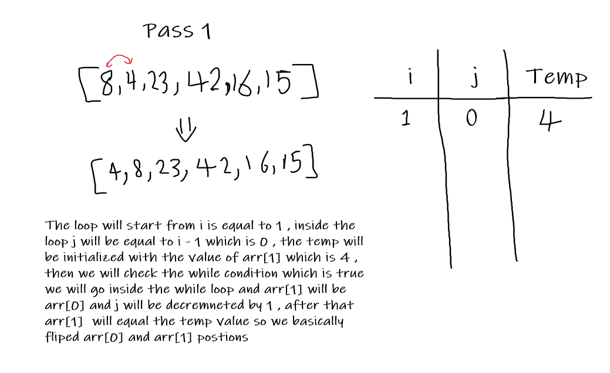
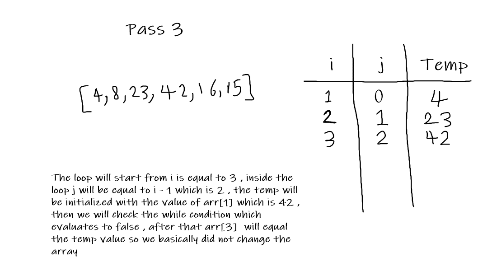
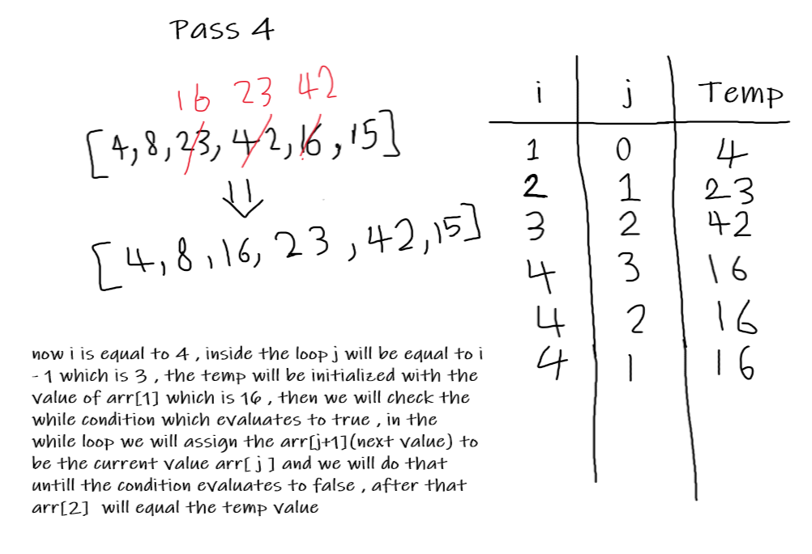
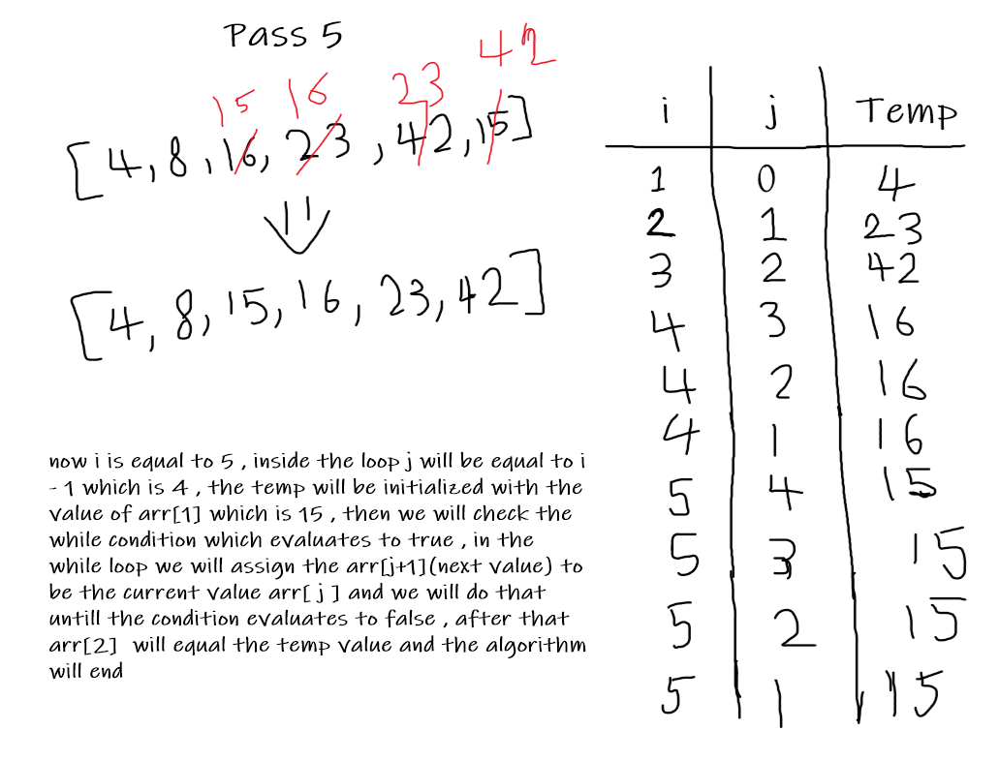

# MY BLOG

---

## First Article : Insertion Sort

Insertion sort is a simple sorting algorithm that builds the final sorted array one item at a time. It is much less efficient on large lists than more advanced algorithms

### Psudocode

### Trace

Array : [8,4,23,42,16,15]

### Passes

### Efficiency

Time Complexity : O(n^2)

Space Complexity : O(1)

[White Board Is HERE](./android/InsertionSort/README.md)

---

## Second Article : Merge Sort

the merge sort algorithm divides the input array into two halves, calls itself for the two halves, and then merges the two sorted halves.

### Psudocode

### Trace

Array : [8,4,23,42,16,15]

### Passes

### Efficiency

Time Complexity : O(log(n))

Space Complexity : O(n)

[White Board Is HERE](./android/mergeSort/README.md)

---

## Third Article : Quick Sort

the quick sort algorithm picks a pivot and position it in its correct position in the array then divide the array at that position to left and right and call itself again on the two halves.

### Psudocode

### Trace

Array : [8,4,23,42,16,15]

### Passes

Instead of going through the code line by line I will explain it using drawings :

Pass 1 : we will first find the position of the pivot which is the last element in the array then we sort each element to either go to the right or left of the pivot whereas the left elements are smaller and the right elements are greater.

Pass 2 : We call the function again for the left and the right arrays recursively with the last element in each array to be the pivot.

Pass 3 : We return the pivot to its right position

RESULT : You get the sorted array

### Efficiency

Time Complexity : O(n^2)

Space Complexity : O(1)

[White Board Is HERE](./android/quickSort/README.md)

---
