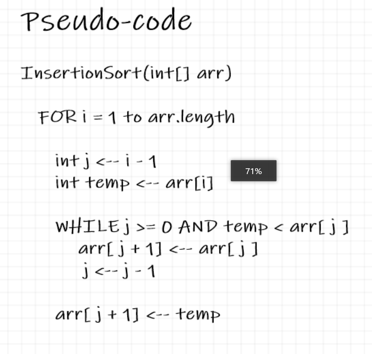
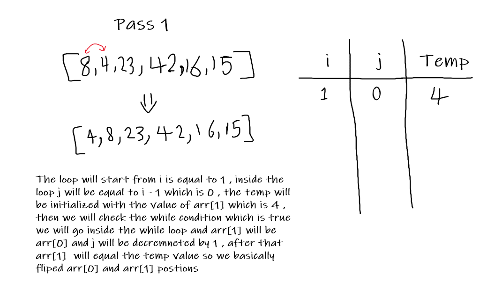
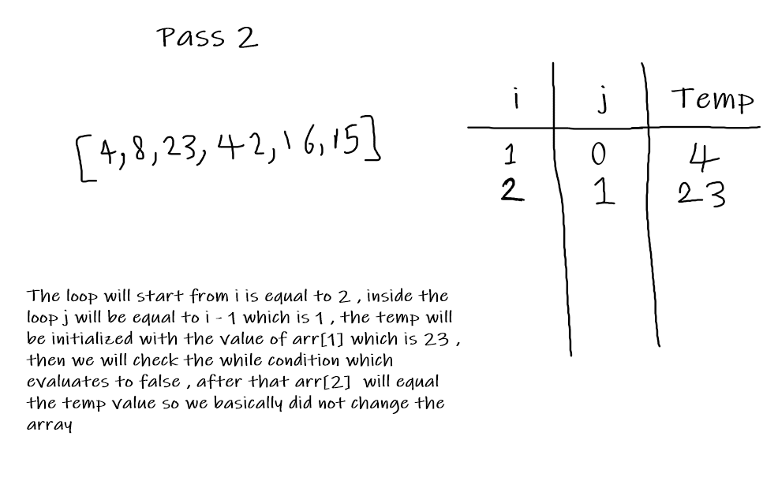
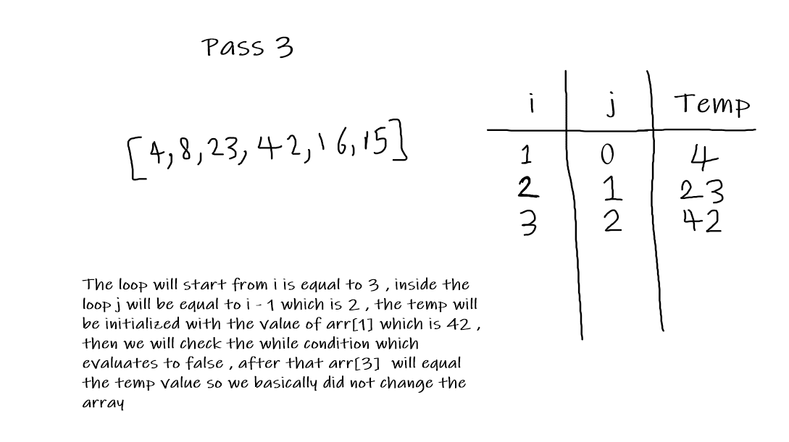
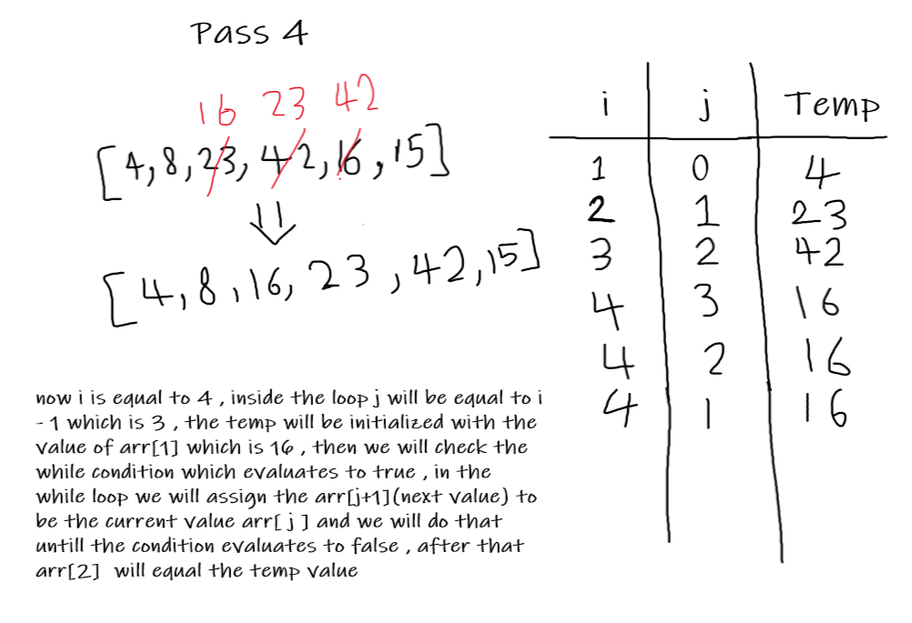
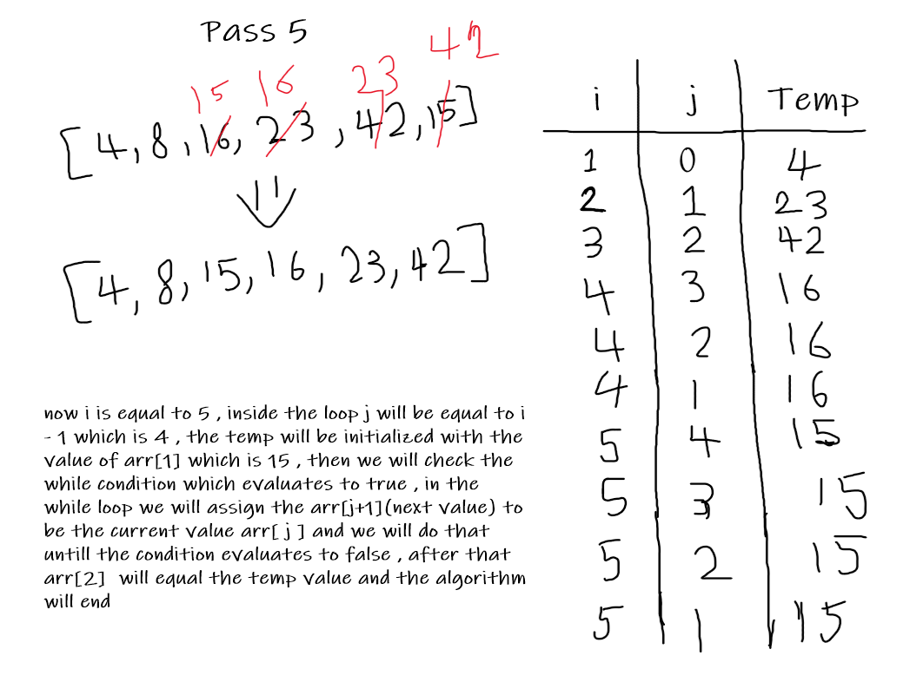

# Insertion Sort

Insertion sort is a simple sorting algorithm that builds the final sorted array one item at a time. It is much less efficient on large lists than more advanced algorithms

## Psudocode

## Trace

Array : [8,4,23,42,16,15]

## Passes

## Efficiency

Time Complexity : O(n^2)

Space Complexity : O(1)
