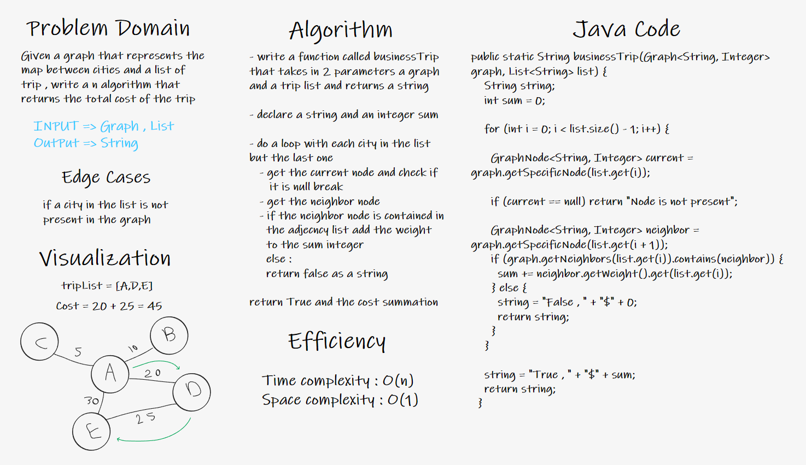
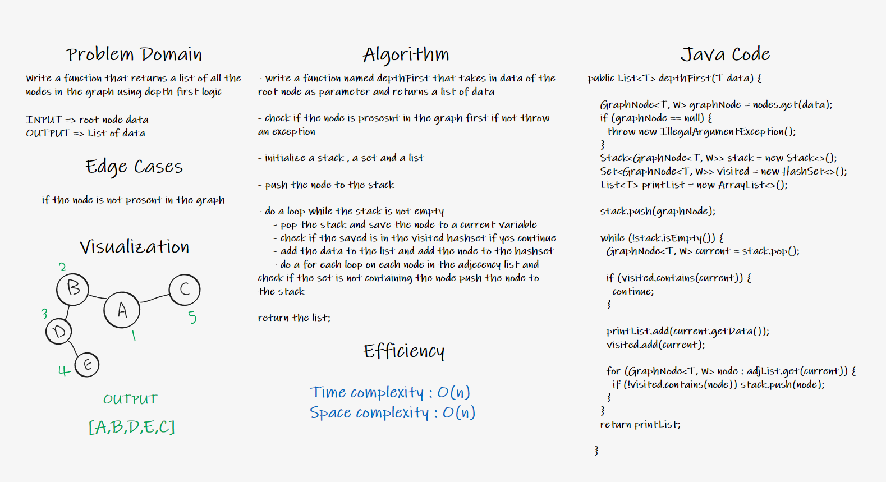

# Graphs

<!-- Short summary or background information -->

A graph is a non-linear data structure that can be looked at as a collection of vertices (or nodes) potentially
connected by line segments named edges.

## Challenge

<!-- Description of the challenge -->

Implement your own Graph. The graph should be represented as an adjacency list

## Approach & Efficiency

<!-- What approach did you take? Why? What is the Big O space/time for this approach? -->

The approach is slicing the implementation to small logical block of codes then implementing and testing them

Time Complexity : O(n)
Space Complexity : O(n^2)

## API

<!-- Description of each method publicly available in your Graph -->

- addNode(T value) : this method adds a new node to the graph
- addEdge(T value1,T value2) : this method adds a new edge between 2 nodes using their values as parameters
- getNodes() : this method returns a list of all the nodes in the graph
- getNeighbors(T value) : this method returns a list of the neighbor nodes to the passed node value
- size() : returns the number of nodes in the graph

---

# Challenges

## Challenge 36

### Challenge Summary

<!-- Description of the challenge -->

Implement a breadth-first traversal on a graph.

### Whiteboard Process

<!-- Embedded whiteboard image -->

### Approach & Efficiency

<!-- What approach did you take? Why? What is the Big O space/time for this approach? -->

Using some built in collections like the hashmaps and the hashsets , also the queues to get the breadth-first nodes list

Time Complexity : O(n)
Space Complexity : O(n)

### Solution

<!-- Show how to run your code, and examples of it in action -->

to run the code just initialize a new graph and add nodes to it then add edges between the edges
then use `graph.breadthFirst(node)` and pass in the required node.

---

## Challenge 37

### Challenge Summary

<!-- Description of the challenge -->

Given a graph that represents the map between cities and a list of trip , write a n algorithm that returns the total cost of the trip

### Whiteboard Process

<!-- Embedded whiteboard image -->

### Approach & Efficiency

<!-- What approach did you take? Why? What is the Big O space/time for this approach? -->

I simply check if the next element in the list is contained in the adjacency list of the current element

Time Complexity : O(n)
Space Complexity : O(1)

### Solution

<!-- Show how to run your code, and examples of it in action -->

To run the function invoke the static method `Graph.businessTrip(Graph , List)` and pass in a graph and the trip list

---

## Challenge 38

### Challenge Summary

<!-- Description of the challenge -->

Conduct a depth first preorder traversal on a graph

### Whiteboard Process

<!-- Embedded whiteboard image -->

### Approach & Efficiency

<!-- What approach did you take? Why? What is the Big O space/time for this approach? -->

Using some built in collections like the hashmaps and the hashsets , also the queues to get the depth-first nodes list

Time Complexity : O(n)
Space Complexity : O(n)

### Solution

<!-- Show how to run your code, and examples of it in action -->

to run the code just initialize a new graph and add nodes to it then add edges between the edges then use `graph.depthFirst(node)` and pass in the required node.

---
