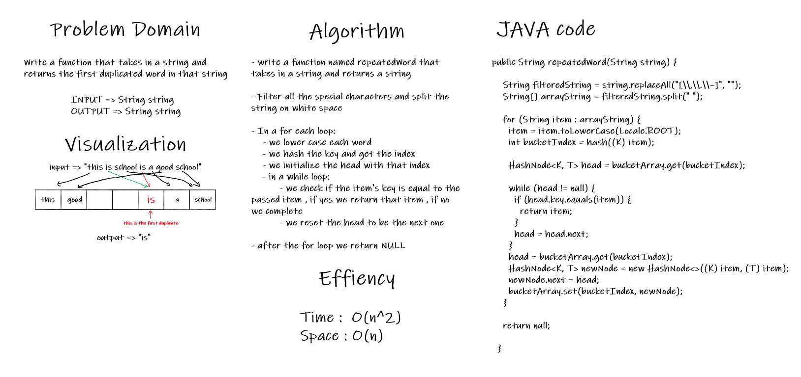

# Hashtables

<!-- Short summary or background information -->

A hash table is a data structure that implements an associative array abstract data type, using a hash function, can which maps keys to values.

## Challenge

<!-- Description of the challenge -->

Implementing the hash table with in Java code with all the following methods : add , get , contains , hash

## Approach & Efficiency

<!-- What approach did you take? Why? What is the Big O space/time for this approach? -->

The hash table uses a simple approach to get the data which is hashing the key and mapping it in a bucket which contains a linked list, when we have a perfect hash table the time complexity is O(1) but because we have linked lists the time complexity is different

Time complexity : O(n)
Space Complexity : O(n)

## API

<!-- Description of each method publicly available in each of your hash table -->

1. add(K , V) : this method takes in a key and a value which will be added to the hash table and returns nothing

2. get(K) : this method takes a key and returns the value of that key if it is in the table if not returns null

3. contains(K) : this method takes a key and returns a boolean depending if the key is in the table or not

4. hash(K) : this method takes a key and returns an integer representing the index location in the array of that key

5. repeatedWord()

---

# repeatedWord()

## Challenge Summary

<!-- Description of the challenge -->

This method takes in a string and check if there is any duplicate word inside it, if yes it returns the word , if not it will return null.

### Whiteboard Process

<!-- Embedded whiteboard image -->

### Approach & Efficiency

<!-- What approach did you take? Why? What is the Big O space/time for this approach? -->

The approach is really simple I will do almost the same as the add method and check for the duplicate

Time complexity : O(n^2)
Space Complexity : O(n)

### Solution

<!-- Show how to run your code, and examples of it in action -->

In order to use the api you just create a new instance of the hash table and then call the method and send the string with its arguments
