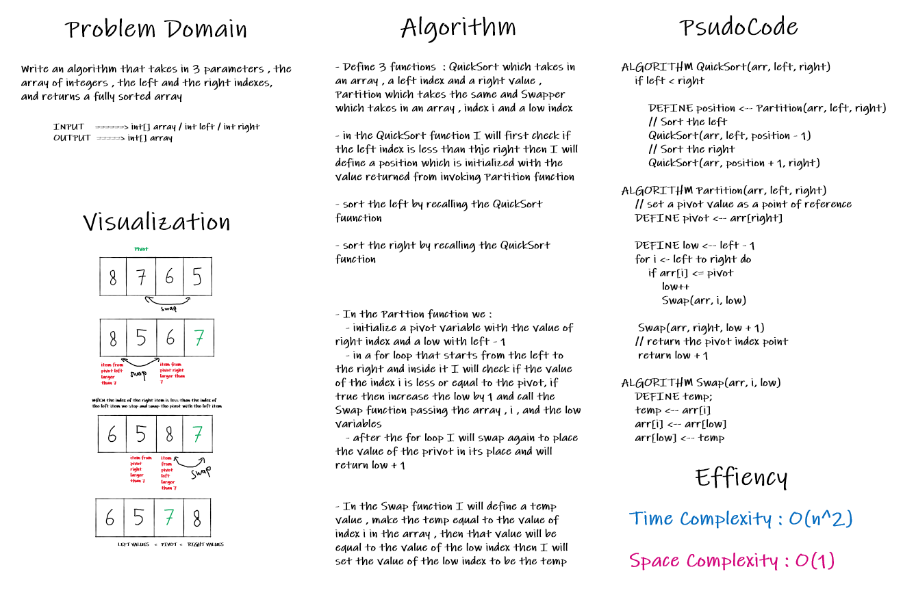

# Challenge Summary

<!-- Description of the challenge -->

Trace the Quick Sort algorithm by stepping through the process using a white board blog

## Whiteboard Process

<!-- Embedded whiteboard image -->

## Approach & Efficiency

<!-- What approach did you take? Why? What is the Big O space/time for this approach? -->

This is stated step by step in the article

## Solution

<!-- Show how to run your code, and examples of it in action -->

This is stated step by step in the whiteboard
