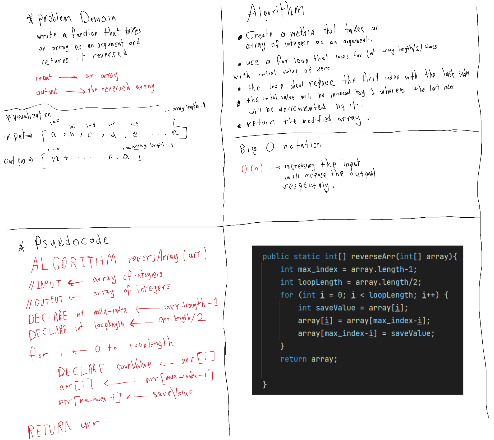

# Reverse an Array

<!-- Description of the challenge -->

Write a function which takes an array as an argument. Without utilizing any of the built-in methods available to your language, return an array with elements in reversed order.

## Whiteboard Process

<!-- Embedded whiteboard image -->

## Approach & Efficiency

<!-- What approach did you take? Discuss Why. What is the Big O space/time for this approach? -->

I used a for loop approach to solve this problem, not only this approach is simple but also it is the best approach for a vanilla array object.

### The big O notion

Time : O(n) => increasing the input will increase the time complexity linearly.
Space : O(1) => increasing the input will always allocate constant space complexity.
