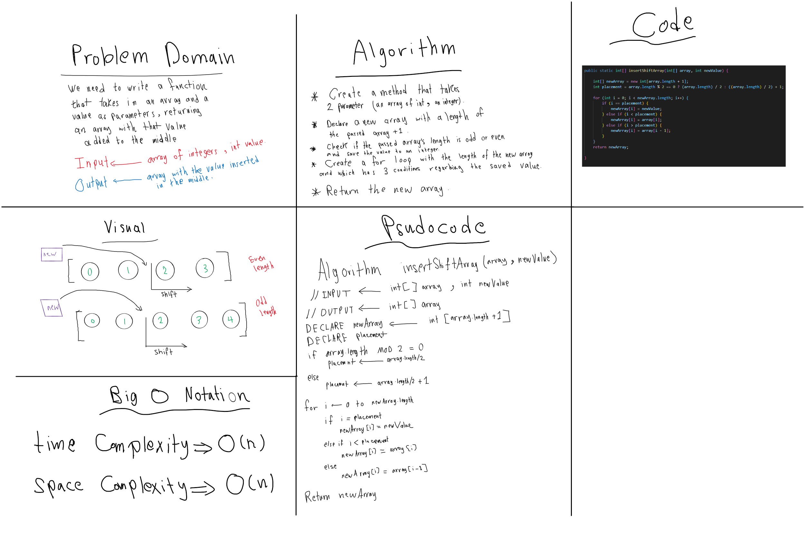

# Insert to Middle of an Array

<!-- Description of the challenge -->

Write a function which takes in an array and a value to be added. Without utilizing any of the built-in methods available to your language, return an array with the new value added at the middle index.

## Whiteboard Process

<!-- Embedded whiteboard image -->

## Approach & Efficiency

<!-- What approach did you take? Discuss Why. What is the Big O space/time for this approach? -->

I first declared a new array then I checked if the length of the passed array is odd or even then used a simple for loop to fill the new array with values.

### The big O notion

Time : O(n) => increasing the input will increase the time complexity linearly.
Space : O(n) => increasing the input will always linearly increasing in memory allocated space complexity.
