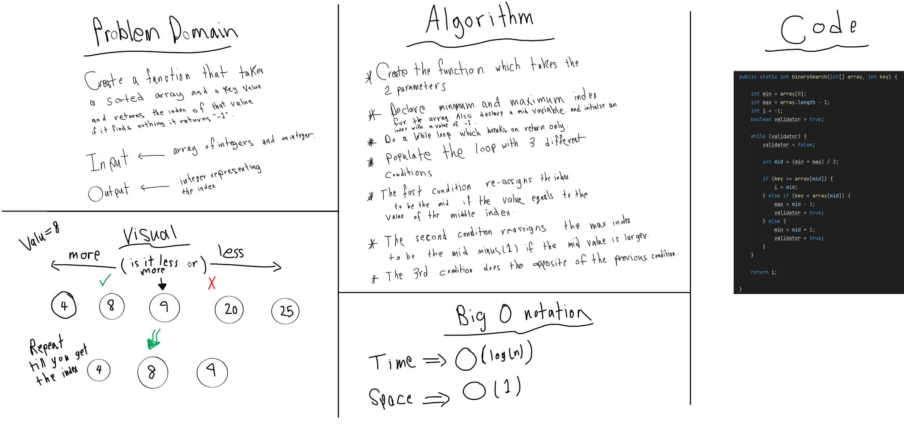

# Binary Search of Sorted Array

<!-- Description of the challenge -->

Write a function which takes in 2 parameters: an array and the search key. Without utilizing any of the built-in methods available to your language, return the index of the array’s element that is equal to the value of the search key, or -1 if the element is not in the array.

## Whiteboard Process

<!-- Embedded whiteboard image -->

## Approach & Efficiency

<!-- What approach did you take? Discuss Why. What is the Big O space/time for this approach? -->

It took me a while but I manged to do it with constant space complexity which is the simplest solution I could come up with, I used a simple while loop which has 3 different conditions each reassigns a specific variable.

My time complexity => O(log(n))
My space complexity => O(1)
