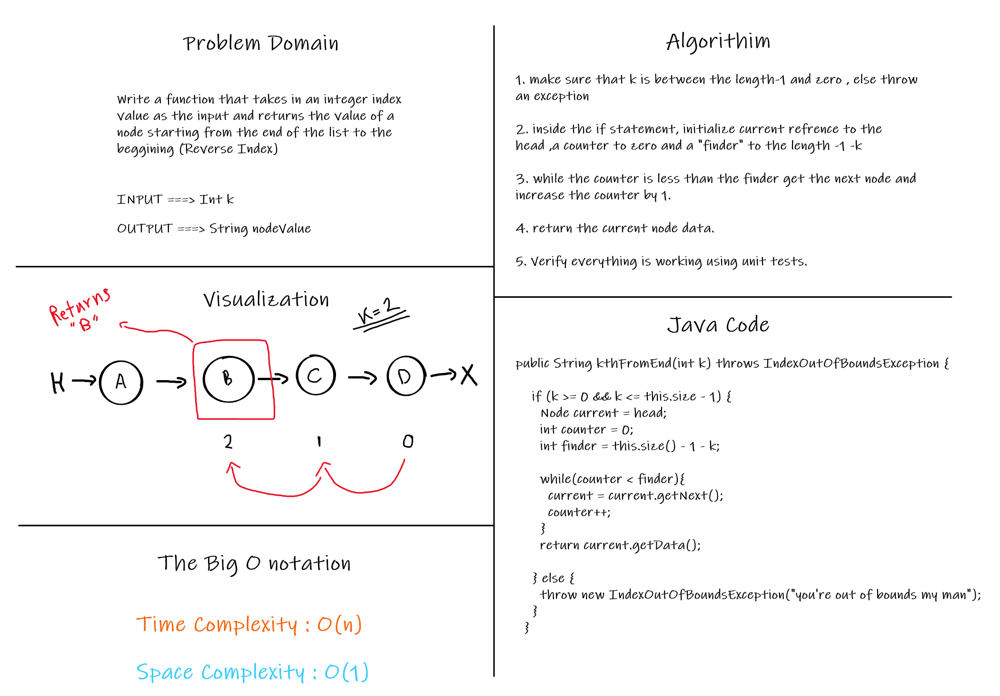

# Challenge Summary

<!-- Description of the challenge -->

The task is to add more functionality to our linked list from the previous challenge.

## Whiteboard Process

<!-- Embedded whiteboard image -->

- KthFromEnd method whiteboard : 

## Approach & Efficiency

<!-- What approach did you take? Why? What is the Big O space/time for this approach? -->

The approach is simple I used two references , current and previous which helped me to determine which comes after and which comes before.

The approach for the kThFromEnd method is to subtract the index from the size as explained in the whiteboard.

## Solution

<!-- Show how to run your code, and examples of it in action -->

To test the code , in the root directory write : `./gradlew test`
