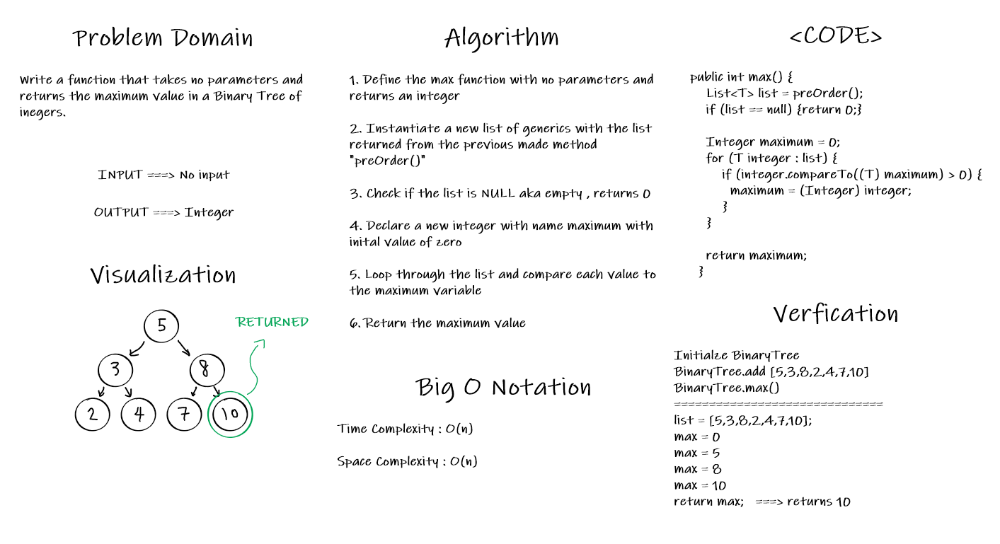
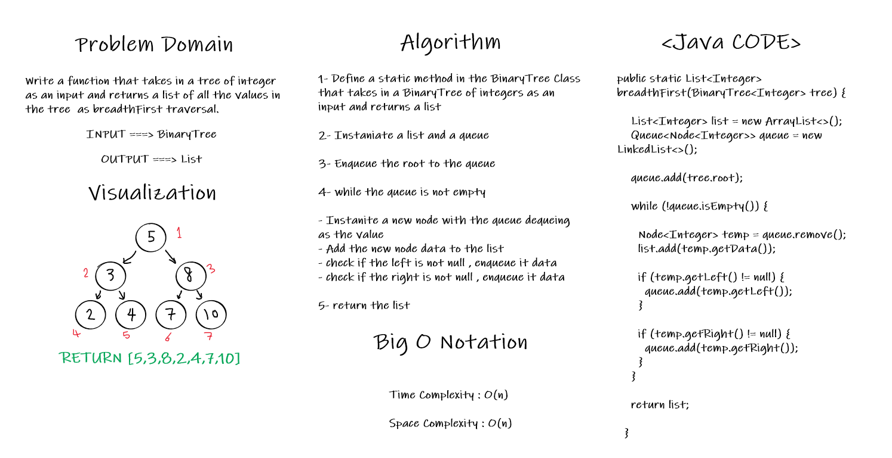

# Trees

<!-- Short summary or background information -->

Trees are a data structure that made of nodes, each node has its own maximum number of children nodes which is K.

Binary search trees are rooted binary trees data structure which internal nodes each store a key greater than all the keys in the node’s left subtree and less than those in its right subtree.

---

## Challenges

<!-- Description of the challenge -->

### Challenge15 Summary

New Implementations :

- Nodes
- Binary Trees
- Binary Search Trees

### Approach & Efficiency

<!-- What approach did you take? Why? What is the Big O space/time for this approach? -->

The approach is simple we compare the node data and add nodes to the tree based on if the data is larger (to the right node) or smaller(to the left node) than the data of the current node

---

### Challenge16 Summary

<!-- Description of the challenge -->

Find the Maximum Value in a Binary Tree

### Whiteboard Process

<!-- Embedded whiteboard image -->

### Approach & Efficiency

<!-- What approach did you take? Why? What is the Big O space/time for this approach? -->

The approach is stated in the whiteboard above.
Time complexity : O(n)
Space Complexity : O(n)

### Solution

<!-- Show how to run your code, and examples of it in action -->

I used a simple solution for this challenge, the postTraversal method returns a list of integers, I simply loop through the list to get the maximum value.

---

### Challenge17 Summary

<!-- Description of the challenge -->

Breadth-first Traversal.

### Whiteboard Process

<!-- Embedded whiteboard image -->

### Approach & Efficiency

<!-- What approach did you take? Why? What is the Big O space/time for this approach? -->

The approach is stated in the whiteboard above.
Time complexity : O(n)
Space Complexity : O(n)

### Solution

<!-- Show how to run your code, and examples of it in action -->

I used a simple solution for this challenge, the breadthFirst method returns a list of integers, I simply loop through the list to get the maximum value.

---

## APIs

<!-- Description of each method publicly available in each of your trees -->

- BinarySearchTree.add() => This api is used to add a new node to the tree in the correct location

- BinarySearchTree.contain() => This api is used to search for data inside the tree and returns a boolean indicating whether the data is in the tree or not.

- BinarySearch.max() => This api is used to return the maximum value for a numeric binary tree.

- BinarySearch.breadthFirst(BinaryTree tree) => This api is used to return the breadth first traversal for a binary tree as a list.
